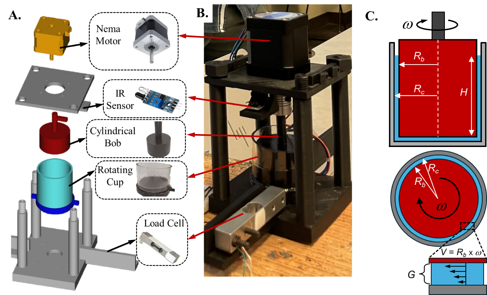

# Low-Cost Rotational Viscometer (LC-RV)

A 3D-printed concentric-cylinder viscometer that reads viscous drag with a $7 load cell on
the cup instead of a rotary transducer on the shaft.

[](LICENSE)



<sub>Adapted with permission from *J. Chem. Educ.* **2025**, *102* (3), 1138-1145.
Copyright 2025 American Chemical Society.</sub>

## The problem

A bench rotational viscometer costs several thousand dollars. The LC-RV moves the
measurement off the shaft: the cup rides on a bearing so it is free to turn, and a
strain-gauge load cell holds it still and reports the restraining force. Everything else
is a stepper motor, an Arduino Nano, a length of acrylic tube and seven printed parts. It
was built for an undergraduate fluid mechanics course and written up in
*J. Chem. Educ.* (below).

## How it works

A NEMA 17 stepper spins the bob at a set speed inside the stationary cup. Viscous drag in
the annular gap tries to carry the cup round with it; the load cell resists and reads that
drag as a force. An IR sensor on a printed encoder disc reports the bob's actual speed
rather than trusting the step rate. Force, speed and the cell geometry then give the
viscosity:

```
omega = 2*pi*RPM/60
gdot  = omega*Rb/G
tau   = F / A                        A = 2*pi*Rc*h
mu    = tau / gdot
```

With the default 43 mm bob (Rb = 21.5 mm, Rc = 23.0 mm, G = 1.5 mm, h = 30.0 mm) that is
gdot = 14.3333 * omega and A = 4.3354e-3 m^2. Why a narrow gap makes the shear rate
uniform across it, the Taylor-number laminar limit, and what the instrument cannot do are
in [docs/theory.md](docs/theory.md).

## Specifications

| | |
|---|---|
| Bob speed | 5-400 RPM, set by potentiometer, measured by IR tachometer |
| Shear rate | about 7.5-600 s^-1 with the 43 mm bob |
| Viscosity | about 5 mPa·s to 2 Pa·s, the ceiling falling as speed rises |
| Sample volume | about 15 mL with the 43 mm bob |
| Annular gap | 1.5 mm default; 3.0, 4.5 and 6.0 mm bobs also printable |
| Cost | about $90 |

## What it measures

Glycerol solutions from 20 % to 100 % and mineral oil each gave a straight
shear-stress-against-shear-rate line whose slope is the viscosity; liquid soap gave an
apparent viscosity that falls as shear rate rises, which is shear thinning. Absolute
values run low against a commercial rheometer, so trends and orders of magnitude are
sound while individual numbers are not traceable. The bearing-friction floor, the load
cell ceiling and the non-Newtonian caveat are in [docs/theory.md](docs/theory.md).

## Build it

1. Print the core set from `hardware/cad/stl/`. The 40, 37 and 34 mm bobs are optional
   spares for the gap study.
2. Buy the bill of materials in [docs/build-guide.md](docs/build-guide.md).
3. Epoxy the acrylic tube into `cup_bottom`, press in the 608-2RS pivot bearing, and stack
   the frame on the M8 rods.
4. Wire it to `hardware/wiring-diagram.svg` and flash `firmware/LC-RV/`.
5. Run `firmware/calibration/calibrate/` with a known mass on the load cell and paste the
   calibration factor it prints into `firmware/LC-RV/config.h`.

Step-by-step instructions, dimensions and the wiring table are in
[docs/build-guide.md](docs/build-guide.md).

## Repository layout

| Directory | Contents |
|---|---|
| `docs/` | Build guide and the theory behind the equations above |
| `firmware/` | Arduino sketch, `config.h`, and the standalone calibration sketch |
| `hardware/` | Parametric CAD source, 10 STLs (seven for a build, three spare bobs), wiring diagram |
| `software/` | `analyze.py` and its requirements, for the logged CSV |
| `data/` | Reference measurements from the paper, as CSV |
| `media/` | Figures from the paper |

## Citation

If you build this or use these files, cite the article:

> Knutson, M.; Weerakoon, S. P.; Ticknor, C. J.; Yavitt, B. M.; Priye, A. Development and
> Implementation of a Low-Cost 3D-Printed Rotational Viscometer for Rheology and Fluid
> Mechanics Education. *J. Chem. Educ.* **2025**, *102* (3), 1138-1145.
> https://doi.org/10.1021/acs.jchemed.4c01490

`CITATION.cff` carries the same reference in machine-readable form.

## Licence

Code, CAD and documentation in this repository are MIT licensed; see [LICENSE](LICENSE).
The figures in `media/figures/` are reproduced from the article above and remain copyright
of the American Chemical Society. They are not covered by the MIT licence.
