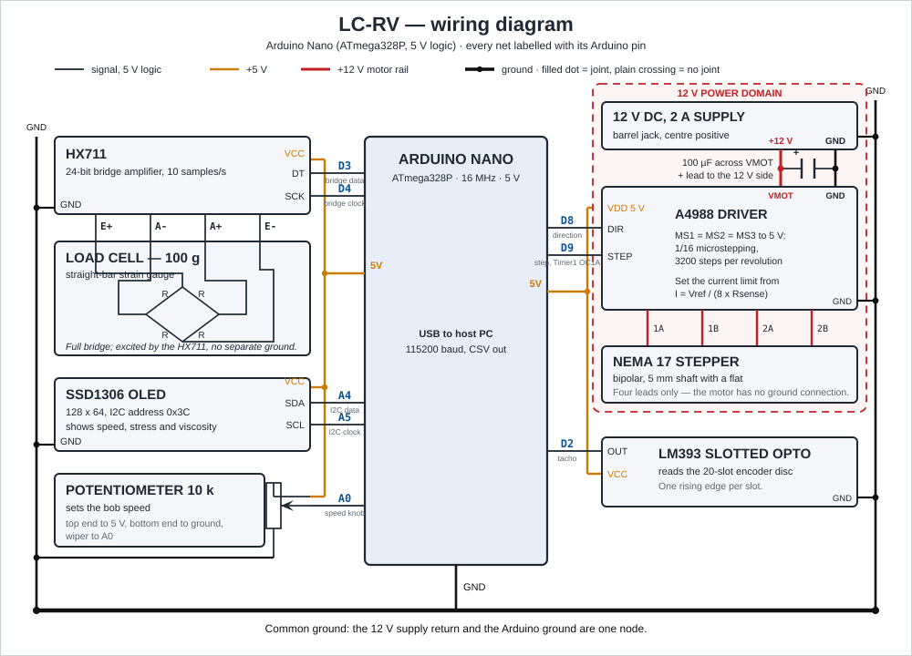

# Build guide

Everything needed to go from an empty bench to a first viscosity measurement, in build
order. Print, assemble, wire, flash, calibrate, measure.

## 1. Bill of materials

| Part | Notes | Qty | ~USD |
|---|---|---|---|
| Arduino Nano | | 1 | 8 |
| A4988 stepper driver | | 1 | 3 |
| NEMA 17 stepper motor | 5 mm shaft with a flat | 1 | 12 |
| 12 V DC supply | 2 A | 1 | 8 |
| Load cell, 100 g | straight bar type | 1 | 7 |
| HX711 amplifier board | | 1 | 3 |
| SSD1306 OLED, 128x64 | I2C version, address 0x3C | 1 | 5 |
| IR slotted opto sensor | LM393 module, digital OUT | 1 | 3 |
| Potentiometer, 10 k | | 1 | 1 |
| 608-2RS bearing | | 1 | 2 |
| Acrylic tube | 50 mm OD / 46 mm ID, 100 mm long | 1 | 7 |
| M8 threaded rod, nuts, washers | 300 mm of rod | 1 set | 5 |
| M3 screws and nuts | | 1 set | 5 |
| Electrolytic capacitor, 100 uF | 25 V or higher | 1 | 1 |
| PLA filament | | 300 g | 8 |
| Two-part epoxy | | 1 | 5 |
| Hook-up wire and jumpers | | 1 set | 3 |
| | | Total | 86 |

Tools: 3D printer, digital calipers, soldering iron, hex keys, small screwdrivers, an
8 mm and a 13 mm spanner, wire cutters and strippers, a multimeter.

## 2. Printing

STLs are in `hardware/cad/stl/`. PLA, 0.2 mm layers, 20 % infill, no supports.

| Part | Qty | Orientation |
|---|---|---|
| `base_plate` | 1 | |
| `motor_plate` | 1 | |
| `cup_bottom` | 1 | tube socket facing up |
| `loadcell_mount` | 1 | |
| `flexure_link` | 1 | flat on the bed, layers running across the thin section |
| `encoder_disc` | 1 | |
| `bob_43mm` | 1 | shaft bore down |
| `bob_40mm` | 1 | shaft bore down |
| `bob_37mm` | 1 | shaft bore down |
| `bob_34mm` | 1 | shaft bore down |

The core set is the seven parts through `bob_43mm`: about 239 g and 10.0 h of printing,
as estimated by `hardware/cad/src/build.py`.

`bob_40mm`, `bob_37mm` and `bob_34mm` are only needed to repeat the gap study.

Before assembling, measure the 22 mm bearing bore in `cup_bottom` with calipers; if the
print came out undersize, ream or sand it until a 608 bearing is a firm push fit.

## 3. Assembly

1. Cut two M8 uprights (about 140 mm) from the threaded rod. Pass each through its hole
   in `base_plate` and lock it with an M8 nut and washer above and below the plate.
2. Fit the M8 pivot bolt upward through the centre hole of `base_plate`, locked with an
   M8 nut and washer under the plate. Press a 608-2RS bearing onto the bolt and secure
   it with a second nut. The bearing outer race carries the cup.
3. Roughen the last 10 mm of the acrylic tube with abrasive paper, mix the epoxy, and
   seat the tube fully into the socket in `cup_bottom`. Wipe the squeeze-out from the
   inside before it sets, keep the tube square to the base, and leave it to cure for
   24 h. Fill it with water afterwards and confirm the joint does not weep.
4. Push the cup assembly down onto the pivot bearing until the 22 mm bore is fully
   seated. Spin it by hand: it should coast freely with no wobble.
5. Bolt `loadcell_mount` to `base_plate` with two M3x12 screws and nuts.
6. Screw the fixed end of the load cell to `loadcell_mount` with two M3x8 screws, free
   end pointing at the cup. Note which end the wires leave from and keep that end fixed.
   `tau = F/A` treats the reading as the tangential force at the cup wall; the printed arm
   sets where the cell bears, so just fit the link square and unstressed.
7. Fasten `flexure_link` between the free end of the load cell and the arm on
   `cup_bottom`, one M3x8 screw at each end. The link should be straight and unstressed
   with the cup at rest.
8. Slide `motor_plate` onto the two uprights and clamp it with an M8 nut above and below
   each upright. Leave the nuts finger-tight for now; step 12 sets the final height.
9. Bolt the NEMA 17 to `motor_plate` with four M3x8 screws, shaft pointing down through
   the plate's clearance hole.
10. Press `encoder_disc` onto the motor shaft above the plate. Bolt the IR sensor module
    to the plate with two M3x10 screws so the disc's slots pass cleanly through its gap
    without touching either side.
11. Press `bob_43mm` onto the 5 mm motor shaft below the plate and tighten its grub screw
    onto the flat of the shaft.
12. Set the immersion. Slacken the `motor_plate` nuts and lower the assembly until the
    flat underside of the bob sits 5 mm above the cup floor, then lock the nuts. Filling
    to the line 35 mm above the cup floor now wets 30 mm of the bob.
13. Turn the bob one full revolution by hand and check it is concentric in the cup, with
    the 1.5 mm gap even all the way round.

Nothing may touch the cup except the pivot bearing and the flexure link. Anything else in
contact adds its own restoring force and the instrument reads low.

## 4. Wiring

| Arduino | To |
|---|---|
| D2 | IR sensor OUT |
| D3 | HX711 DT |
| D4 | HX711 SCK |
| D8 | A4988 DIR |
| D9 | A4988 STEP (Timer1 OC1A - must be D9) |
| A0 | potentiometer wiper |
| A4 | OLED SDA |
| A5 | OLED SCL |

A4988 MS1, MS2 and MS3 go to 5 V for 1/16 microstepping, 3200 steps per revolution.
The 12 V supply feeds VMOT with the 100 uF capacitor directly across VMOT and its
ground; fit it before applying power. Everything else runs from the Nano's 5 V rail, and
the 12 V supply and the Arduino share one ground.

Set the A4988 current limit before the first run: with the driver powered and the motor
disconnected, measure Vref on the trim pot and set it from `I = Vref / (8 * Rsense)`.
Read Rsense off the board's sense resistors and choose I at or below the motor's rated
phase current.

## 5. Firmware

Install three libraries through the Arduino IDE Library Manager:

| Library | Author |
|---|---|
| HX711 Arduino Library | bogde |
| Adafruit GFX Library | Adafruit |
| Adafruit SSD1306 | Adafruit |

Open `firmware/LC-RV/LC-RV.ino` and edit `config.h` to match what you built:

| Define | Set to |
|---|---|
| `BOB_DIAMETER_MM` | 43.0 for the default bob, otherwise 40.0 / 37.0 / 34.0 |
| `CUP_RADIUS_MM` | 23.0 (half of the 46 mm tube bore) |
| `WETTED_HEIGHT_MM` | 30.0, the wetted bob height set in assembly step 12 |
| `LOADCELL_CAPACITY_G` | 100.0 |
| `CALIBRATION_FACTOR` | filled in by section 6 |

Select Tools > Board > Arduino Nano and the ATmega328P processor, pick the port, and
upload. Open the serial monitor at 115200 baud: the sketch prints a CSV header and then
one line per reading. Readings before calibration are the right shape but the wrong
size.

## 6. Calibration

The HX711 gives raw counts; the firmware needs counts per gram. Calibrate the cell on its
own, with `flexure_link` unbolted and the motor unpowered, so nothing but the mass loads
it. Upload `firmware/calibration/calibrate/calibrate.ino`, set a small empty pan on the
free end of the cell and tare. Put a known mass in the pan, let the reading settle, and
the sketch averages the counts and prints `CALIBRATION_FACTOR` in counts per gram.

Repeat with one or two other masses across the range you expect to measure. The factor
should come out the same each time; if it drifts, the cell is touching something or the
mount is flexing. Paste the value into `config.h`, re-upload `LC-RV.ino`, and refit the
flexure link.

## 7. First measurement

Mix 80 % glycerol by mass: 80.0 g of glycerol to 20.0 g of distilled water, stirred
until uniform and then left to stand until the entrained bubbles have cleared.

Fill the cup to the 35 mm line, check the bob still turns freely, and power up. Set the
potentiometer to about 300 RPM and let the reading stabilise before recording anything.
At that speed 80 % glycerol, near 0.06 Pa.s at room temperature, should read about 12 g
on the load cell: `F_g = 6.3366 * mu * omega`, with `omega` = 31.4 rad/s. Save the serial
stream to `run.csv` with any terminal that can log a port at 115200 baud, keeping the
header line.
Let it run for a minute or two, stop it, and analyse:

    python software/analyze.py run.csv

Literature viscosities for glycerol solutions at 20 and 25 C are in
`data/reference/glycerol-viscosity-reference.csv`. Expect the trend to be right and the
absolute value to come out under the literature figure; see
[theory.md](theory.md) for why.
